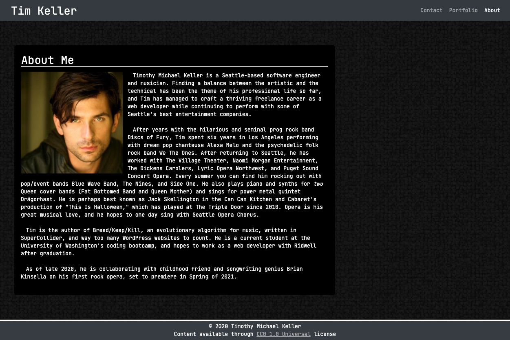

# hw-02-responsive-portfolio
UW Bootcamp homework assignment: Responsive portfolio site.

## About the Author

Timothy M. Keller is a web developer and musician residing in Seattle, WA.

Email: timothy.m.keller@gmail.com

Github: https://github.com/tmkeller

LinkedIn: https://www.linkedin.com/in/tim-keller-he-him-his-3ab55bb1/

## Objectives

Create a sleek, stylish 3-page portfolio site with the following attributes:

* A navbar.
* A responsive layout.
* Responsive images.
* Minimal use of @media queries.
* Approximate matching of reference images provided by UW bootcamp staff.
* Bootstrap grid system.
* Pages that leave margin and padding space for screen sizes above "sm," but mostly eliminate them for smaller screen sizes.
* HTML that passes online HTML validation.
* Functional, deployed application
* GitHub repository with README describing the project
* Consistent Navbar across pages.
* Navbar on each page must contain links to Home/About, Contact, and Portfolio pages.
* All links function on all pages.
* Usage of semantic html.
* Personalized information. (bio, name, images, links to social media, etc.)
* Proper use of Bootstrap components and grid system.

## Product

[Live Site URL](https://tmkeller.github.io/hw-02-responsive-portfolio/)

## Technologies

## License

[CC0 1.0 Universal](https://creativecommons.org/publicdomain/zero/1.0/)
